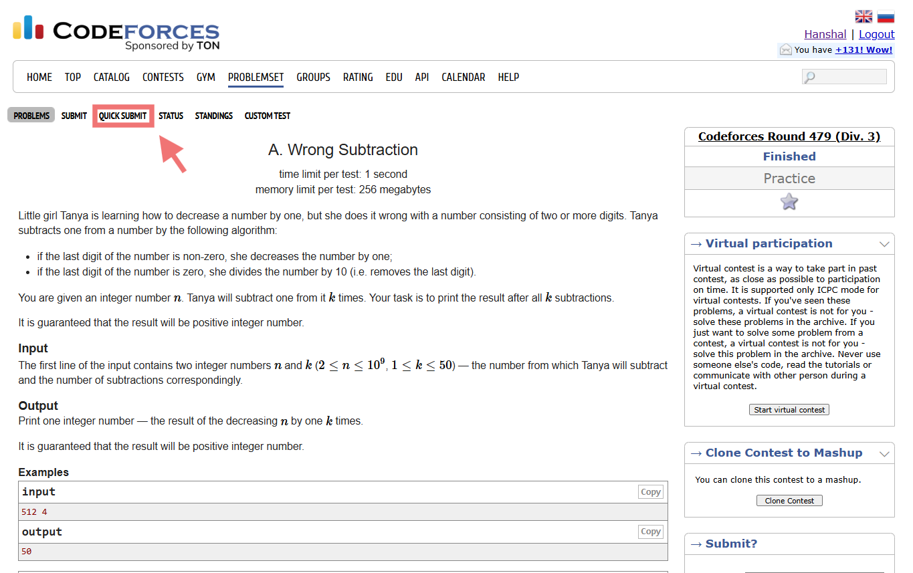
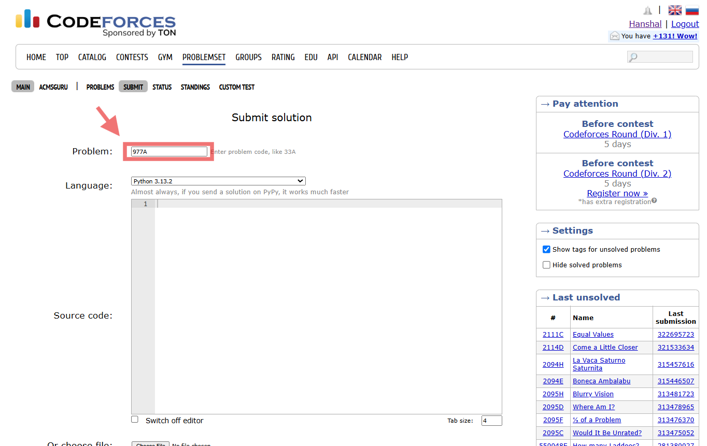

# Codeforces Quick Submit

[](LICENSE)
[]()
[]()

A lightweight browser extension that adds a native **Quick Submit** button to Codeforces problem pages.

## Features

✅ One-click submission

✅ Automatically detects problem codes

✅ Auto-fills the submission form

✅ Native Codeforces styling

✅ Supports:

* Problemset Problems
* Contest Problems
* Gym Problems

✅ No tracking

✅ No analytics

✅ No data collection

---

## How It Works

From a problem page:

https://codeforces.com/problemset/problem/977/A

Click:

Quick Submit

The extension automatically opens the submission page and fills:

977A

No more manually typing problem IDs.

---

## Screenshots

### Problem Page



### Submission Page



---

## Installation

### Brave / Chrome

1. Download this repository
2. Extract the ZIP
3. Open:

```
brave://extensions
```

or

```
chrome://extensions
```

4. Enable Developer Mode
5. Click Load Unpacked
6. Select the project folder

---

## Privacy

This extension:

* Does not collect data
* Does not send data anywhere
* Does not track users
* Runs entirely locally

---

## Author

Hanshal Bobate

---

## License

MIT License
